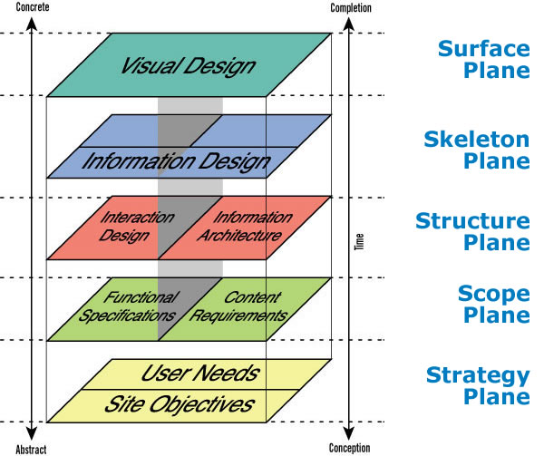
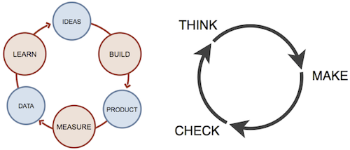
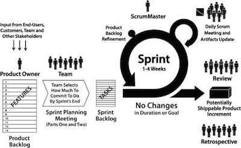
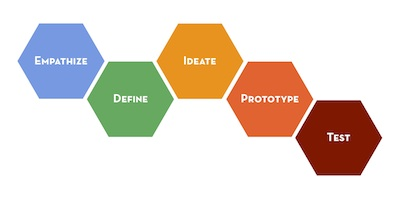
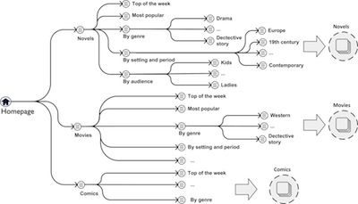
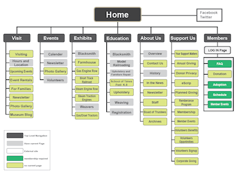
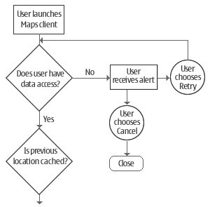
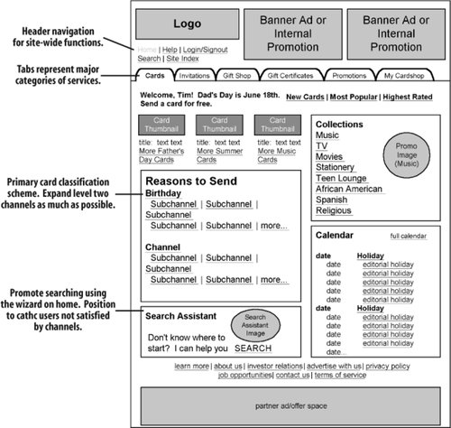

# UX Bootcamp
August 13, 2014

Thomas Wendt

---

#### Thomas Wendt, Design Strategist and Researcher
* thomas@srsg.co
* @thomas_wendt 

#### Agenda

| Time  | Topic  |
|---|---|
| 10:00-11:00  | [UX Foundations](#ux-foundations)  |
| 11:00-12:00  |  [User Research](#user-research) |
| 12:00-12.15  |  Break |
| 12.15-1:00  |  [Usability and User Testing](#usability-and-user-testing) |
| 1:00-2:00  |  Lunch |
| 2:00-3:00  |  [Information Architecture](#information-architecture) |
| 3:00-3.30  |  [Sketching](#sketching) |
| 3.30-3.45 |  Break |
| 3.45-4.45  |  [Wireframing and Prototyping](#wireframes) |
| 4.45-5:00  | Wrap Up | 

### <a name="us-foundations">UX Foundations</a>

* Make an Affinity Map
	* Reorganizing ideas into groups so you can see where ideas are
* Definitions
	* Experience Design - How screens are interacting with each other or how flows are interacting with each other
		* Mapping out experiences and all decision points on the way there
		* Making the internet easier to use for regular people. A lot of experience design was born out of how the web looked in the mid to late 90s, where websites weren't architected well. 
* Everyday UX
	* When you have a flight cancelled, think about your entire experience from board, to flight attendants to gate attendants, etc. After you plane was cancelled, did the airline book a hotel room for you or upgrade you to first class or do nothing? 
		* Someone made a decision at some point and said if we have an "act of god" we do nothing. This has a strong effect on the user. 
* Jesse James Garrett
	* One of the first people to start talking about UX Design
	> "UX is the design of anything independent of medium or across media, with human experience as an explicit outcome and human engagement as an explicit goal."
	* Human aspect is at heart of UX Design
	* UX Design can be completely independent of medium, doesn't have to be tied to websites or apps. 
	* Elements of User Experience Graph
	
		
		
* Experiential Disciplines
	* Psychology
	* Sociology
	* Anthropology
		* Cultural influences
	* Philosopy
		* Study of human experience. How do we actually experience things
* UX vs UI
	* There is confusion between experience design and interface design. 
	* **Interface design** is literally designing the interface in front of you.
	* **Experience design** is more hazy - it's designing the experience around the interface. 
* Deliverables != The Entirety of UX
	* Even though this is one of the only tangibles things UX creates, there is a lot more to it
* Science vs Design
	* Science
		* Truth-driven
		* Inductive
		* Logical
		* Convergent
	* Design
		* Solution-driven
		* Abductive
		* Creation
		* Divergent
	* Types of Reasoning
		* Deduction
			* what we know to be absolutely true
		* Inductive 
			* where science or work of detective comes in. gather evidence and given what we know, figure out what is most likely
			* What we believe to be true based on what we know
		* Abduction
			* Where design comes in. Based on what we know, these are the possibilities for what could be. 
			* While the first two deal with the knowledge we have know, abduction mean based on what we know now what could be. It's always looking forward. 
* Best Practices
	* They are very rare
	* They only work in certain controlled situations
	* Don't rely on them
	
---

### Process

* 5 D's - Waterfall Process
	* Steps
		* Discover
		* Define
		* Design
		* Develop
		* Deliver
	* Discovery
		* Do user research
		* What are user problems
		* Deliverables:
			* Personas
				* An archetype of groups of users. Once you do a bunch of user research, interviews or studies, you collect a lot of findings. 
			* User Scenarios
	* Define
		* create the Interaction Model
		* Define the Content & Functionality Requirements, Information Architecture
		* Come up with Project Plan along with milestones and deliverables
		* Deliverables
			* Product Requirement Document
				* Similar to user stories
				* Documenting product requirements
	* Design
		* All ideas are put into paper sketches and go through a usability evaluation. 
		* Sketches transformed into wireframes and shown to clients
		* Once approved, proceed with creating mockups/UI designs
		* Deliverables
			* Sitemap
			* User flows
				* Flow diagrams - map out all decision points that a user would have to make to interact with a particular product. From the first time they sign in until the end. 
				* Allows you to take a very birds eye view of the product and zoom into certain areas.
			* Wireframes	
				* A blueprint for a screen
			* Specifications (mobile)
				* Wireframe for mobile with arrows pointing to descriptions
			* UI Designs
		* Development
			* Coding
		* Deployment
			* Usability Testing
			* Major issues corrected and other observations captured for next release
			* Deliverables
				* Usability Test Report
* Lean UX (Alternative to Waterfall)
	* Somewhat popular since 2010/2011. 
	* Based on lean manufacturing motives from Toyota
		* Cut as much waste as possible from manufacturing
	* Applied to UX, takes a practical approach
		* Focuses on 3 stages: build, measure and learn
		
		
* Agile UX (another alternative)
	* In itself it's a software methodology, a way for developers to work
	* Takes the waterfall process and chunks it up into smaller pieces
	* Devs work in sprints instead of working on the entire dev phase of the project
		* Built features, test them, then move on
		
		
* Design Thinking
	* Rich background in academia and business
	* Emphasizes finding a problem, coming up with solutions, then test if solutions are appropriate
	
	
	
---
	
### <a name="user-research">User Research</a>

* Why do it?
	* Ensures you're solving a problem that exists in people's lives
		* Yo app is an example of a product that isn't solving any problem
	* Key to building a product that is tailored to its audience
		> If you're building a product for everyone, you're really building it for no one.
		
		* Even Facebook has features built to cater to specific groups of users
		* Focus on nuanced groups of people
	* Ensure that your product solution aligns to analogous behaviors
* Components
	* Reasons for Research
		* Exploratory
			* Find out what the landscape looks like, what people's day-to-day lives look like
		* Validating
			* We're already building something and want to gut-check that it's the most appropriate solution
	* What Research Helps Answer
		* Why
			* Why does a problem exist
			* What isn't being people within the environment
		* What
			* What are behavioral patters
			* What motivates them to do what they do
			* What do they think about
			* What are their needs and frustrations
			* What are their habits and what do their routines look like
				* What is the difference between what they say they do and what they actually do 
		* When
		* Who
		* Where
		* How
			* How are people dealing with problems you've already identified
			* Do solutions already exist or are they hacking their own solutions together
				* if the latter it says a lot to the things we can design
* How do we get this information (Types of UX Research)
	* **Ethnography**
		* What is it?
			* Literally means 'writing culture'
				* Insert yourself into different communities or user bases
			* Being there
			* Deep hanging out
			* Observation
		* Pros v Cons
			* Pros
				* The most rich research method we have 
				* Allows for very deep insight into behavior
			* Cons
				* Can sometimes be costly
	* **Surveys**
		* What is it?
			* Allow for gathering a quantifiable information from a large number of people
				* Bad at finding what motivates people
			* Most are completed online through tools like Survey Monkey
		* Pros v Cons
			* Pros
				* Gather large numbers of responses very quickly
				* Get quantitative feedback immediately
			* Cons
				* Hard to get rich responses
				* Often learn about problems but not why they occur
				* Hard to write surveys
				* Subject to many cognitive biases
	* **Interviews**
		* What is it?
			* One-on-one discussions with end users
			* focused on probing behaviors
		* Pros v Cons
			* Pros
				* One-on-one discussion
				* Can gather rich, targeted information
				* Flexible, can explored tangents or unexpected areas
			* Cons
				* Can be time consuming to organize, run and analyze
				* Subject to many cognitive biases
* Where to Find Participants
	* The hardest part is finding the right people
		* important to get right users, not just anyone off the street
	* Where to find them:
		* anywhere you believe your users spend time
			* Coffee shops
				* tell them you're a student because people like talking to students - less off-putting, not selling something, etc.
			* Social networks and forums
			* Craigslist ads
				* Create a screener survey on survey monkey to weed out people you don't want to talk to: ask age, etc. Get $25 for an hour of time
			* Recruiters
* How to Ask Questions
	* Be wary of priming
	* Don't ask leading questions
	* Never ask about intention, always probe behavior
		* Bad Question - "How many times do you plan to go to the gym?"
		* Good Question - "How many times have you been to the gym in the last 3 months"
	* Focus on specific instances
		* Have you ever had _____ problem?
		* Tell about the last time you...?
	* Avoid generalizations and speculations
		* What do you usually...?
		* What do you intend to...?
	* Keep people talking
		* Tell me more about hat
		* What do you mean by...
		* Help me understand better..
	* Embrace awkward silences
		* Often the best insights come up when participants feel the need to fill silent voids
		* one of the best skills you can have as an interviewer is learning how to *shut up*
* Interview Prep
	* Record if possible
		* Always ask permission
		* Explain why and that it's for private use
	* Focus on topics rather than list of questions
		* Should be a conversation
	* If you divert off topic: "That's really interesting. Can you tell me how that connects to..."
* During the Interview
	* Start off with small talk, even if you hate it
	* Take notes but remain focused on participant. 
**Analyzing Results**
	* Interpretation
		* People have no idea what they want
		* Put off conclusions until you interpret your findings
		* It's your job to interpret what they say
		* What is said only accounts for a small piece of the actual research insights
			* it's your job as a designer to interpret what people told you

### Personas

* One of the big deliverables from research are personas
* What is a persona?
	* An archetype of a group of users
	* Created by conducting user research and summarizing trends into one or more archetypes
	* Does NOT represent a single person
	* Findings
		* Needs
		* Frustrations
		* Ideal Features
		* Key attributes
			* Knowledge
			* Experience
			* Help use
			* Confidence
* Why are Personas Important
	* Communication Tool
	* Good way to gut check yourself
		* Way to question why you should do something - build something. Is it a need for one of the personas? 
	* Useful for summarizing what you know about your user
	* Will help to highlight pain points and opportunities to tailor your product to your user
	* Keep your product focused on your key users rather than building for the whole world
	* Keep in mind, this is just a framework, not a blueprint 
* Basic Persona Template
	* Box of 4: bio and demographics, behaviors, stories & scenarios, goals/needs
* Challenges of Personas
	* They can be artificial, abstract, fictitious
		* No way to know for sure you're interpreting research findings correctly
	* They are a composite sketch of multiple people all rolled into one
	* They don't have opinions
	* They can't talk back, answer questions, or give feedback
	
### <a name="usability-and-user-testing">Usability and User Testing</a>

* Why Do It?
	* Obtain feedback directly from users
	* Discover WHY problems are occurring
	* Gain insight into motivations and satisfaction
	* Because data alone isn't enough
* Methods
	* "Formal" usability:
		* Requires a facility
		* Can be quite costly
		* Often produces a laboratory feel, difficult for users to be comfortable
			* Non-contexutal. Nobody does this in a lab, they do it at home, work, etc. Misses environmental piece. 
	* Cafe Test
		* Going to a public place and recruiting participation in short, casual test
		* Use this method for informal validation of simple prototypes
		* Can be seen as risky when working with big brands
		* Recruitment demographic has to be broad
	* Remote Usability
		* Sharing a prototype or live site with a participant over screen sharing software
		* Use when you want a wide geographic swath
	* Unmoderated
		* Working with a company like usertesting.com to create a flow a user goes through on their own
		* You then get videos of their mouse/screen as well as audio being picked up from their webcam
		* Good for when you're busy with other things and just want to read the results
	* Face-to-Face
		* This is the recommended method (body-language or facial expressions)
		* Provide users with tasks to complete on a prototype
		* Encourage them to talk out loud as they move through interactions
			* Keep people talking about what they're thinking
			* If they're confused they'll say so out loud
		* Observe their actions
* Preparation
	* Create task scenarios
		* Should describe the task in a clear and unambiguous way
		* Written in the user's language (don't use jargon)
		* Don't prompt the solution
			* Give general direction and have them figure it out themselves: "find a product and add it to your cart"
* Task Scenario Example
	* You want to book a romantic holiday for you and your partner for valentine's day, how would you do that?
	* NOT: Go to the homepage of romanticholidays.com and click 'sign up now' then click valentine's day
* Things to Avoid
	* Asking pax what they "like"
		* They will only tell you what you want to hear
		* Tomar Sharon at Google has a talk, "Don't listen to users". Instead observe what they do
	* Asking pax to predict the future
		* Asking if a pax would use something like X or might enjoy X feature is not productive
		* Instead, either ask about current behavior (do you currently do X?) or show them something and observe how they interact with it
	* Leading people
		* Let them make their own mistakes; that is valuable
		* If you give the answers, you'll never learn what you need to learn
* Outputs
	* Usually in the form of notes and sometimes video/audio recordings
	* Usability labs will create full reports
	* Unmoderated tests will provide data reports and recorded sessions
	* When writing research notes, remember to:
		* Report on the good and the bad
		* Avoid making conclusions (that will come later)
		* Stick to what you observed in the test
		
### <a name="information-architecture">Information Architecture</a>

* Roots in library science
* Definition
	* The structural design of shared information environments
	* The art and science of organizing and labeling web sites, intranets, online communities and software to support usability and fundability
	* On a broader scale, IA is about creating shared understanding and structured meaning for information spaces
* [Video on Information Architecture](http://vimeo.com/8866160)
* **Ontology** (Concept Maps)
	* Establishes structured knowledge
	* Maps understanding
	* Surfaces relationships
* Taxonomy
	* Organizes meaning
	* Maps categories
	* Creates hierarchy 
	
	
	
	
* Choreography
	* How individual pieces of data interact with one another
	* Includes both synchronized actions (designs) and improvisation (emergence) - things you didn't plan for, but that people took on themselves
	
#### Heuristics

* Findable: able to be located
	* Can users easily locate that which they are seeking?
		* Maps - can you easily find what you want?
	* How is fundability affected across channels and devices?
* Accessible: easily approached or entered
	* Can someone easily enter into a website and know what they need to do
	* Offline: wheelchair ramps
* Clear: easily perceptible
	* Is it easy to understand?
	* At first glance can a user understand what the site is all about
	* Example:
		* Newspapers. 
* Communicative: Talkative, informing
	* Is it giving useful feedback for the process you're going through
	* Example: you're paying a bill and it shows you a progress bar as it goes through. this is a system being communicative
	* Example: you're on a subway and the train stops in the middle of the tunnel and intercom mumbles, not communicative 
* Useful: capable of producing a desired result
	* difference between novice users and expert users. 
	* building in features for people unfamiliar to the product
	* Amazon's buy with one click button and add to cart button
* Credible: worthy of confidence 
	* important anytime someone enters a credit card
	* every startup website they have banner of nascar press logos - all the newspapers that wrote about us - they're going for credibility 
* Controllable: able to adjust
	* is a system flexible enough where people can adopt it to their own use patters - or should it be
		* think of something like twitter stream being completely customizable. you can follow people you want and not follow people that you don't 
		* airplane cockpit isn't controllable because it has to be standardized 
* Learnable: able to be fixed in the mind
	* learning a bike. once you've learned it, you remember it
* Delightful: greatly pleasing
	* is something pleasing

#### IA Deliverables

* Site Maps
	* Takes all of the content of a website and organizes it in a way to make the most sense. 
	* Start with homepage and categorizes it.
		* usually turns into navigation of site
	* Laying out blueprint before you get started
	
	
	
* Content Inventories
	* Individual pieces of content on a site
* Task Flows
	* Mapping out the various ways a user will move through a system
	* Map how someone completes a goal
	
	

### <a name="sketching">Sketching</a>

* Sketching doesn't have to do with artwork, just getting something on paper to help you think. 
* What is Sketching?
	* Sketching is the rapid paper-based visualization of high-level ideas, with the aim of capturing their simples essence
	* It's (probably) not digital nor detailed
	* Designed for sharing
	* Quick, cheap, timely, and disposable
	* Like many things in UX design, it's more about the activity than the artifact
* Sketching is not about beautiful illustration. It's a basic skill that everyone should have to some degree. 
	* More important skill is the ability to explain your sketches and the thinking behind them
	* Fidelity of your sketches should match the fidelity of your thinking
		* If you're completely at the beginning of a process, your sketches will probably be rough and not detailed
		* As you work through iterations, they will get more and more detailed and you refine your ideas
* Tools
	* Sharpies
	* Post-Its
	* iPad app called Paper
* Examples
	* Process
		* Similar to task flow
		* Process of doing something
	* Interface
		* Screens on tablets, phones, desktop, etc. 
		* Interface designs - great thing to do before getting it in digital form
	* Scenario
		* Storyboards, just like a comic book
		* Go through different scenes of an experience 
* Some Elements
	* Sketching screens isn't difficult. Just like wire framing. 
	* Thinking behind it is what's important 
	* Elements
		* Search boxes
		* Drop down boxes
		* Media boxes
		* Box with 'x' represents image (add play button to make video player)
		* Text - indicated with horizontal lines
	
### <a name="wireframes">Wireframes</a>

* What are they?
	* Each wireframe represents one page. 
		* Page-level schematic diagrams designed for communication
	* They represent the kinds of content you see on the screen on a website or app
	* They illustrate the key user interface of a product, and in aggregate give an overall sense of how the parts of a product hang together 
* What's it do?
	* Easily communicate to UI Designer and Developer what you want
	* To UI Designer: this is the general layout we want
	* Notes on side mostly talk to developers
* Wireframing an experience
	* Wireframes bring together several things:
		* Structure
		* Navigation
		* Information Hierarchy
		* Interactions
	* The fidelity of our deliverables should match the fidelity of our thinking
	
	
* Challenges
	* Separating the concerns of structure, navigation, layout, interaction
	* Keeping the documentation up-to-date
	* Managing changes across multiple wireframes
	* Fitting the level of detail to the audience
		* Who's going to see these things? Are you creating final wireframes for designers and developers or very rough version to show business or marketing person? 
	* Explaining the wireframe to clients	
		* If you don't work within technology design in some capacity it's very rare you know what a wireframe is
		* No matter how much you preface it, people will always look at it and think that's the design of the webpage 
* Are they useful?
	* Different organizations have different cultures, working practices, and resources. Not everyone is jumping straight to making very lean, interactive prototypes yet!
		* Some organizations spend months building huge wireframe documents - hundred page documents 
	* We use wireframes like an architect would show blueprints of a house design - detailed thinking, but still cheaper than building a working model
	* We use them to articulate our design thinking to ourselves in the same way we use sketches, only at a greater level of detail
* Tools
	* The standard is [omnigraffle](https://www.omnigroup.com/omnigraffle). Not necessarily a wire framing tool, but a diagraming tool. 
	* Some people use illustrator 
	* There are a ton of new ones that have come out in the last few years
		* [Balsamiq](http://balsamiq.com/)
		* Podoko
		* Proto.io
		* Flinto
* Personal Style
	* There are no hard and fast rules, and everyone has their own style
	* But there are some standard conventions
* Styles
	* Basic Block Diagram
	* High Level Sketches
		* Paper sketch, but more details with notes and annotations 
	* High Level Digital
		* Not terribly detailed, but show what you need
	* Detailed and Annotated
		* Fully detailed and fully annotated 
	* Uncommon
		* Responsive Wireframes
* General Tips
	* Be clear about your objective before you start
	* Go for function over aesthetics
	* Grey levels for emphasis, color to convey meaning
	* Collaborate with your team
	* Be consistent in your level of detail
	* Justify every element's existence
	* Be clear and professional in documentation  

### Prototyping

* What is a prototype?
	* Early sample or model to test a concept or process or to act as a thing to be replicated or learned from
	* Prototypes are a way to enact something
		* In mobile, it's a way to play out how someone would go through actions before spending time or money. You may learn it's completely useless
* Why Prototype
	* It's all about testing
		* Prototyping is a means of exploring ideas before you invest in them
* When to Prototype
	* Discover
		* What is the user's normal process
	* Define
		* Where is our position within the greater market?
	* Design
		* Do users understand our features? 
			* Do users understand what you're building?
			* Your solution may not be the best solution to the problem
		* The bulk of it
* Types of Prototyping (From visual low fidelity to code high fidelity)
	* Paper
		* Index Cards
		* Hacky
		* Great when you don't have a lot of time or money
	* Keynote Interactive PDF
		* You can make some nice looking wireframes and prototypes with this software 
		* [Keynotopia](http://keynotopia.com/) is a wireframe stencil for Keynote
	* Fireworks (Balsamiq)
	* [Hype](http://tumult.com/hype/) | [Hotgloo](http://www.hotgloo.com/)
	* HTML/JavaScript
		* Really great for testing certain animations or things that aren't easy to do with a prototyping software
* Paper Prototypes
	* Sketchy looking
	* Someone could interact with it, but it may take more guidance
	* Fastest and cheapest way of doing it
* Keynote Prototype
	* 